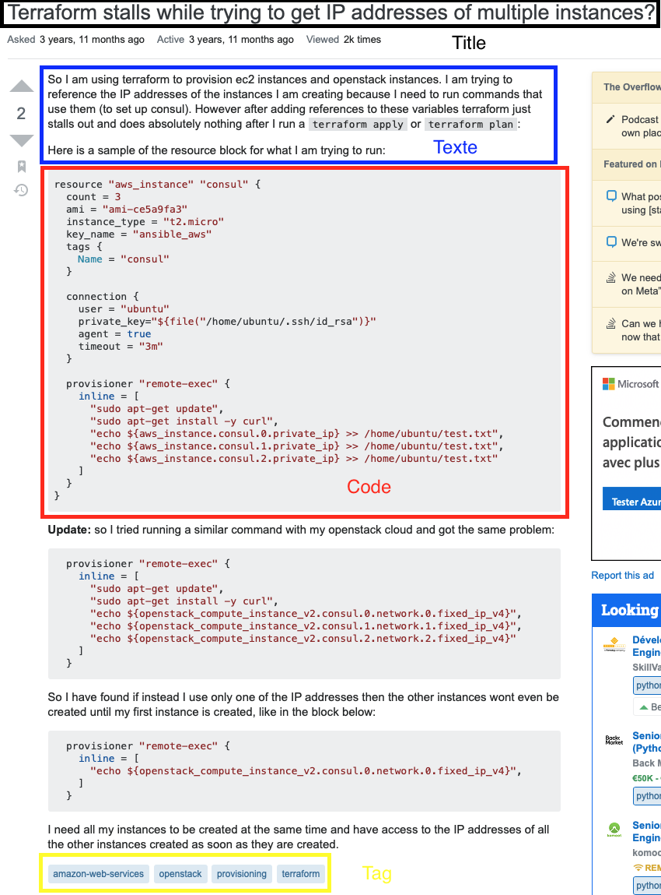
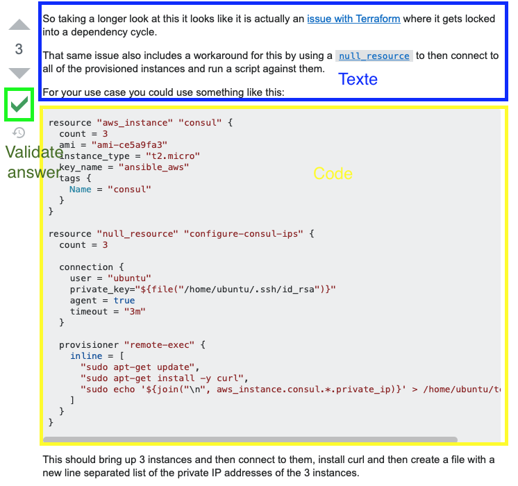
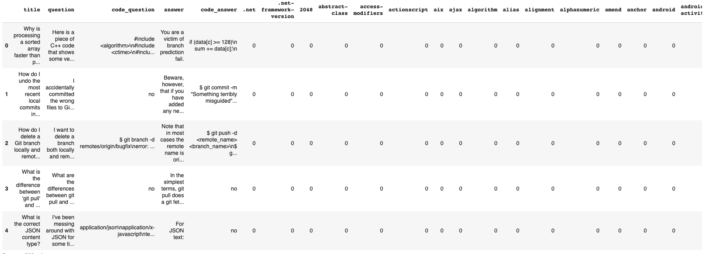

# Stackoverflow Generate Answer

## Motivations :
We want to build a tool that scrapes the Stackoverflow website and, for every question, (generally a question reflects a symptom of a problem) it predicts two things:
* The root cause of the problem
* The solution (answer) of the problem 

## Table of contents
* [Helpful Link For The Project](#Helpful-Link-For-The-Project)
* [File Descriptions](#File-Descriptions)
* [Futur Release](#Futur-Release)
* [Technologies](#technologies)
* [Contact](#Contact)
## File Descriptions
This project is in three parts :

### dataframe.py
In this files, we create a tool that scrapes the Stackoverflow website and for every question with validate answer we collect some informations.

As you can see, we can have many informations on the question part :
* The title.
* The question.
* Sometimes we can have the code that generates an error.
* Tags: Tags can help us about the packages, or they can tell us which technologies or which langages are used.

On the Answer part :
* The text answer.
* Sometimes we can have the code.
* Validate Answer Tag.

The code part in the answer can help us to identify the root cause. 
Furthermore, the validation tag allows us to identify if the answer is good or not.

We decided, because of bias, to keep only the questions that had a validated answer.

### embedding.py

In this file, you will find a class that creates our own Embedding based on the Fasttext algorithm.
We decided to create our own Embedding matrix for context reasons.

Let's take an example, the word "abstract", the definition of this word is "An abstract is a brief summary of a research article" but for stackover flow the real definition is "A class is called an Abstract class if it contains one or more abstract methods. An abstract method is a method that is declared, but contains no implementation.".

So that's why we need our own Embedding Matrix.

### model.py

In this file, you will find differents functions : 
* One to use the Embedding class.
* One to create Trai, Test, validation set.
* One to build our model.
* One to fit the model.
* One for our loss function (sparse_categorical_crossentropy).
* One to predict a Numpy array.

## Futur Release
This is the first version of the project and much improvement is planned in the coming weeks.
* Parallelization of the for loop in dataframe.py.
* Use SVD for the tags features.
* Use matrix factorization from SVD as new inputs feature of our Neural Networks. 
* Add Shapley Values to interprete the model. 

## Technologies
### Languages
Project is created with Python 3.6.9.

### Dependencies

* [Tensorflow](https://www.tensorflow.org)
* [NumPy](https://numpy.org)
* [scikit-learn](https://scikit-learn.org/stable/)
* [Matplotlib](https://matplotlib.org)
* [pandas](https://pandas.pydata.org)
* [gensim](https://radimrehurek.com/gensim/)
* [NLTK](https://www.nltk.org/)
* [re](https://docs.python.org/3/library/re.html)

## Contact

* Mail: isaaccohensabban_at_gmail_dot_com
